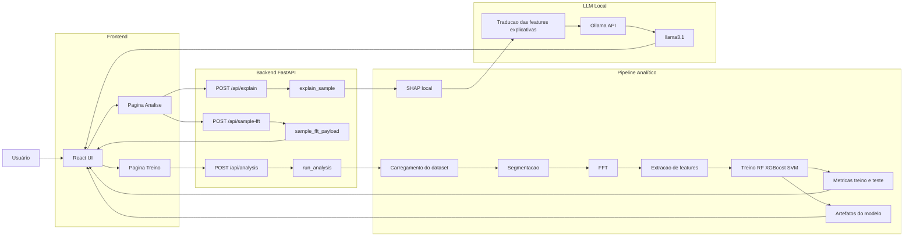

# predictive_maintenance_fft_ml_xai_llm

## Visão geral

Este projeto aplica FFT, aprendizado de máquina, XAI e LLM para manutenção preditiva com sinais de vibração de uma caixa de engrenagens planetárias.

O repositório possui dois fluxos principais:
- o notebook original, com o pipeline analítico completo
- a interface web, com React + FastAPI + Ollama usando `llama3.1` local

## Estrutura principal

- `notebook/01_predictive_maintenance_fft_ml_xai_llm.ipynb`
- `backend/app/main.py`
- `backend/app/pipeline.py`
- `backend/app/llm.py`
- `frontend/src/App.jsx`
- `requirements.txt`

## Problema tratado

O objetivo é classificar a condição da engrenagem solar do segundo estágio da caixa de engrenagens planetárias.

## Classes

- Classe 0: Normal
- Classe 1: Desgaste Superficial
- Classe 2: Dente Trincado
- Classe 3: Dente Lascado
- Classe 4: Dente Ausente

## Requisitos

### Backend e notebook

- Python 3.11+ recomendado
- `pip`
- dependências de [requirements.txt](c:/Projetos/projeto_aplicado/predictive_maintenance_fft_ml_xai_llm/requirements.txt)

### Frontend

- Node.js 18+ recomendado
- `npm`

### LLM local

- `Ollama`
- modelo local `llama3.1`

Comandos esperados:

```powershell
ollama pull llama3.1
ollama run llama3.1 "responda apenas ok"
```

## Dados

- Os datasets podem ficar em `data/` ou `data/raw/`
- o backend detecta automaticamente arquivos como `x_1500_10.npy`, `y_1500_10.npy`, `z_1500_10.npy` e `gt_1500_10.npy`
- o dataset padrão da interface foi alinhado para `1500_10`, seguindo o notebook

### Exemplo de estrutura

```text
data/
  raw/
    x_1500_10.npy
    y_1500_10.npy
    z_1500_10.npy
    gt_1500_10.npy
```

### Link de referência

`https://drive.google.com/drive/folders/1eJWnxC4rEQXuOxAbNJ6IErWKJHqsXry0?usp=drive_link`

## Diagrama do pipeline web



## Fluxo da interface

### Página Treino

- seleção do dataset e parâmetros principais
- execução do mesmo pipeline base do notebook
- geração de artefatos do modelo
- métricas de treino e teste
- gráfico comparativo
- matriz de confusão

### Página Análise

- seleção do modelo e da amostra
- visualização da FFT por eixo
- explicação por LLM local
- auditoria das features explicativas
- auditoria de prompt
- tokens e latência da geração

## Notebook original

### Instalação

```powershell
python -m venv .venv
.venv\Scripts\activate
pip install -r requirements.txt
```

### Execução

```powershell
jupyter notebook
```

### Etapas do notebook

- carregamento dos sinais de vibração por eixo
- visualização no domínio do tempo
- segmentação em janelas
- FFT por segmento
- extração de features no tempo e na frequência
- treino dos modelos `RandomForest`, `XGBoost` e `SVM`
- matriz de confusão e curva ROC
- explicabilidade local com SHAP
- geração opcional de texto técnico

## Como rodar o backend

```powershell
python -m venv .venv
.venv\Scripts\activate
pip install -r requirements.txt
python -m uvicorn backend.app.main:app --reload
```

## Como rodar o frontend

```powershell
cd frontend
npm install
npm run dev
```

## Como habilitar o modelo local

```powershell
ollama pull llama3.1
ollama serve
```

## Endereços padrão

- Frontend: `http://localhost:5173`
- Backend: `http://localhost:8000`
- Swagger: `http://localhost:8000/docs`

## Auditoria disponível

### Pipeline e explicação

- features explicativas com `feature`, `valor_feature`, `shap_value` e `impacto_absoluto`
- leitura técnica da feature
- evidência traduzida enviada para a LLM
- `system prompt`
- `user prompt`

### LLM local

- `ollama_model`
- `temperature`
- `num_predict`
- tokens do prompt
- tokens de resposta
- tokens totais
- latência total
- carga do modelo
- resposta final do modelo local

## Arquivos gerados

- imagens do notebook continuam em `images/`
- artefatos dos modelos ficam em `outputs/model_artifacts/`
- auditorias de features da LLM ficam em `outputs/llm_feature_audits/`

Esses diretórios são artefatos de execução e não devem entrar no primeiro commit do projeto.
